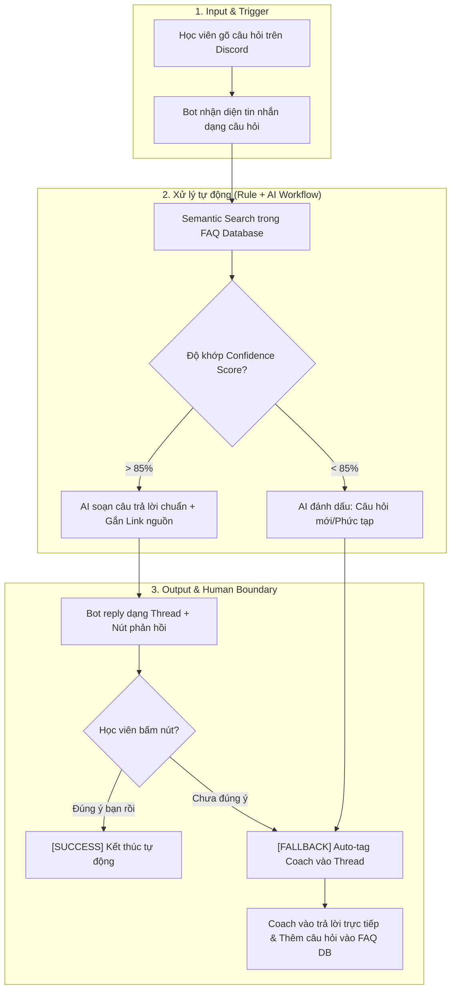

# Group Report — Day 02

# 02 — Group Problem Statement: Tự Động Trả Lời Câu Hỏi Lặp Lại Trên Discord

---

## Thành viên nhóm & Vai trò

| STT | Họ và tên | Mã học viên | Vai trò trong nhóm | Đóng góp chính |
|-----|-----------|-------------|--------------------|----------------|
| 1 | Nguyễn Tuấn Vũ | 2A202601845 | Nhóm trưởng / Pitcher | Pitch bài toán Discord FAQ, tổng hợp tài liệu, thiết kế Workflow & PS |
| 2 | Nguyễn Hữu Khánh Tùng | 2A202601781 | Member / Technical Research | Research công cụ (Slack AI, Dyno Bot), phân tích RAG FAQ Knowledge Base |
| 3 | Nguyễn Văn Phong | 2A202601087 | Member / Workflow & Boundary | Phân tích quy trình trước/sau, định nghĩa Human Boundary & Fallback |
| 4 | Nguyễn Phúc Hưng | 2A202601115 | Member / Validation & Metric | Phỏng vấn Coach & Học viên, xây dựng Success Metric & con số Baseline |

---

# Phase 3 — Group Convergence (Hội Tụ Nhóm)

Nhóm 4 thành viên tiến hành pitch 11 candidate cards cá nhân, sau đó thực hiện gom nhóm (cluster), shortlist và chấm điểm đồng thuận để chọn 1 candidate problem duy nhất.

### 3.1 Bảng tổng hợp các bài toán đã pitch

| # | Người đưa ra | Candidate Problem | Người gặp vấn đề (Actor) | Điểm nghẽn (Bottleneck) | Cảm nhận & Đánh giá nhanh của nhóm |
|---|---|---|---|---|---|
| 1 | Nguyễn Tuấn Vũ | Quét các câu hỏi lặp lại trên Discord | Coach Lab / Học viên | Admin/Coach phải gõ trả lời lại 5-10 lần/ngày | Rất tiềm năng: Pain thực tế tại lớp, workflow rõ. |
| 2 | Nguyễn Tuấn Vũ | Tra cứu kiến thức cũ từ Slide/Note | Sinh viên | Ctrl+F lội từng file PDF mất 20-30 phút | Tiềm năng nhưng scope xử lý file rải rác hơi rộng. |
| 3 | Nguyễn Hữu Khánh Tùng | Auto viết Daily status từ Git commit | Dev / Học viên | Đắn đo gõ lại daily update mỗi cuối ngày | Rất hay, workflow kỹ thuật khép kín. |
| 4 | Nguyễn Hữu Khánh Tùng | Quét CV để tìm JD phù hợp | Sinh viên tìm việc | Tìm JD khớp với năng lực trên các trang tuyển dụng | Khá hay nhưng nguồn JD bên ngoài hơi phân tán. |
| 5 | Nguyễn Văn Phong | Quét chat/email tổng hợp deadline | Học viên | Tìm deadline bị sót trong nhiều nhóm chat | Scope quá rộng, vướng API/Permission ứng dụng. |
| 6 | Nguyễn Văn Phong | Quét chat Zalo/Mess update bài nhóm | Thành viên nhóm | Theo dõi tiến độ công việc nhóm rải rác | Vướng quyền truy cập riêng tư Zalo/Messenger. |
| 7 | Nguyễn Văn Phong | Quét Zoom/Meet phân công nhiệm vụ | Thành viên họp | Ngồi nghe lại record để ghi action items | Cần transcript họp chuẩn, rủi ro âm thanh kém. |
| 8 | Nguyễn Phúc Hưng | Quản lý & phân loại Email học tập | Sinh viên | Trôi email quan trọng từ trường/giáo viên | Rule/Filter của Gmail đã giải quyết được 80%. |
| 9 | Nguyễn Phúc Hưng | Quét điểm danh online & tính tiền học | Trung tâm / Phụ huynh | Nhập liệu thủ công buổi học và gửi SMS | Bài toán phần mềm quản lý truyền thống (Rule-based). |
| 10 | Nguyễn Phúc Hưng | Render slide bài giảng giáo trình | Giảng viên | Định dạng lại slide bài giảng thủ công | Chưa rõ cấu trúc dữ liệu đầu vào. |

### 3.2 Gom trùng & Nhóm chủ đề (Clustering)

| Cluster | Candidates thuộc cluster | Pattern chung | Ghi chú & Đánh giá |
|---|---|---|---|
| A. Hỗ trợ tự động hóa trên Discord/Git | #1 (Discord FAQ), #3 (Git Daily) | Tự động hóa quy trình trao đổi/báo cáo học tập trên Discord dựa trên dữ liệu có sẵn. | Rất khả thi: Workflow rõ ràng, dễ truy cập dữ liệu trong lab. |
| B. Tổng hợp thông tin đa ứng dụng | #2 (Slide Search), #4 (CV Match), #5, #6, #7 (Multi-app Search/Recap) | Gom thông tin rải rác từ nhiều nguồn (Mess, Zalo, Zoom, PDF) để tổng hợp. | Scope rộng, vướng bài toán API & cấp quyền riêng tư. |
| C. Tự động hóa quy trình quản lý | #8 (Mail Filter), #9 (Điểm danh), #10 (Render Slide) | Quy tắc quản lý cố định (Email, tính tiền, format). | Có thể giải bằng Rule/Phần mềm truyền thống (No-AI). |

### 3.3 Shortlist & Chấm điểm đồng thuận

Nhóm lọc ra Top 3 Candidate Problems tốt nhất để đưa vào bảng chấm điểm đồng thuận:

| Candidate Problem | Actor rõ | Workflow rõ | Pain có Evidence | Impact đo được | Làm trong lab | So sánh R/W/A | Nhóm hiểu Domain | Tổng điểm |
|---|---:|---:|---:|---:|---:|---:|---:|---:|
| Candidate A: Discord FAQ Assistant | 5 | 5 | 5 | 5 | 5 | 5 | 5 | 35 / 35 |
| Candidate B: Git Commit Daily Status | 5 | 5 | 4 | 4 | 4 | 5 | 4 | 31 / 35 |
| Candidate C: Zoom/Meet Action Item Recap | 4 | 3 | 4 | 3 | 2 | 4 | 4 | 24 / 35 |

####  Quyết định chọn của nhóm:
* Candidate nhóm chọn: Tự động tra cứu & trả lời câu hỏi lặp lại trên Discord cho Coach & Học viên (Discord FAQ Assistant).
* Vì sao chọn:
  1. Pain point ngay trước mắt: Tất cả học viên và Coach trong lớp hiện tại đều trải qua tình trạng tin nhắn trôi quá nhanh, hỏi lại cùng 1 vấn đề 5-10 lần/ngày.
  2. Workflow & Metric cực kỳ rõ ràng: Baseline đo lường bằng thời gian chờ của học viên (15-30 phút → <30 giây) và công sức của Coach (giảm >80% câu hỏi trả lời thủ công).
  3. Ranh giới an toàn (Human Boundary): Dễ dàng cấu trúc hệ thống theo hướng AI gợi ý draft/nút bấm, Coach hoặc hệ thống chỉ trả lời khi Confidence Score cao.
* Vì sao không chọn các bài toán khác:
  * *Git Commit Daily*: Bài toán hay nhưng chỉ phục vụ cá nhân Lập trình viên, không giải quyết bài toán giao tiếp diện rộng cho cả nhóm/lớp.
  * *Zoom/Meet Recap & Multi-app*: Rủi ro phụ thuộc vào API bên thứ 3 (Zalo/Zoom/Gmail) và quyền truy cập dữ liệu quá phức tạp cho 1 buổi lab.

---

# Phase 4 — Quick Validation & Research Giải Pháp

### 4.1 Quick Validation (Kiểm chứng thực tế)

Nhóm thực hiện khảo sát và phỏng vấn nhanh 4 Học viên trong lớp:

| Nguồn kiểm chứng | Mẫu / Số người | Tín hiệu xác nhận (Confirm) | Tín hiệu phản bác (Disconfirm) | Nhóm điều chỉnh Problem thế nào |
|---|---:|---|---|---|
| Học viên | 4 Học viên | 4/4 người ngại tìm lại tin nhắn cũ hoặc ngại đọc kênh `#faq` dài, tiện tay gõ hỏi thẳng lên kênh chat chính. | 1 người quen dùng tính năng Search của Discord. | Bổ sung giao tiếp tự nhiên: Bot trả lời trực tiếp dạng Thread ngay tại câu hỏi, không bắt học viên nhảy kênh. |

> Insight sau Validation: Pain point không nằm ở việc "không có tài liệu FAQ", mà nằm ở việc tài liệu FAQ nằm rời rạc khiến học viên ngại đọc, dẫn đến hành vi hỏi lặp lại gây ngập tin nhắn.

### 4.2 Research các giải pháp đã có trên thị trường

| Nguồn / Công cụ / Pattern | Link tham khảo | Họ giải quyết phần nào? | Điểm mạnh | Khoảng trống / Rủi ro | Bài học kéo về cho nhóm |
|---|---|---|---|---|---|
| Discord AutoModerator / Dyno Bot | https://dyno.gg/ | Tự động trả lời theo từ khóa cố định (Keyword match) | Chạy nhanh, nhẹ | Rất cứng nhắc, sai từ khóa là không hoạt động được | Rule thuần túy (Keyword match) không đủ vì học viên hỏi bằng nhiều cách diễn đạt khác nhau. |
| Slack AI (Search & Answer) | https://slack.com/help/articles/25076892548883 | Tự động tóm tắt & trả lời câu hỏi trong channel | Trả lời tự nhiên theo ngữ cảnh | Chi phí cao, chỉ dành cho doanh nghiệp lớn | Pattern tốt: AI đọc kho FAQ → Tạo phản hồi ngắn gọn kèm đường dẫn nguồn (Citations). |

> Bài học từ Research: Không nên dùng Rule thuần túy (như Dyno Bot) vì học viên gõ bằng câu từ tự nhiên khác nhau. Cũng không nên thả cho AI trả lời tự do (dễ hallucinate). Giải pháp tối ưu là Workflow kết hợp: RAG Search kho FAQ chuẩn → AI diễn đạt câu trả lời → Đính kèm nút phản hồi để người thật kiểm tra.

---

# Phase 5 — Workflow & Problem Statement v0

### 5.1 Current Workflow (Quy trình hiện tại — 7 bước)

```text
CURRENT STATE — Tổng thời gian: ~30 phút/câu hỏi lặp lại

[1. Học viên gõ câu hỏi lên kênh chat chung: 1']
  → [2. Tin nhắn bị trôi do các hội thoại khác: 10-20']
  → [3. Học viên khác tiếp tục gõ câu hỏi tương tự: 1']
  → [4. Coach phát hiện câu hỏi lặp lại: 2']
  → [5. Coach lội tìm lại link/câu trả lời cũ trong chat hoặc docs: 5']  <-- BOTTLENECK
  → [6. Coach gõ lại câu trả lời và tag học viên: 3']
  → [7. Học viên đọc được phản hồi: 1']
```

| Bước | Actor | Input | Output | Thời gian / Tần suất | Bottleneck |
|---|---|---|---|---|---|
| 1 | Học viên | Thắc mắc về bài lab/deadline | Tin nhắn trên kênh chat | 1 phút / 5-10 lần/ngày | Không |
| 2 | Kênh Discord | Tin nhắn học viên | Khối tin nhắn bị trôi | 10-20 phút | Không |
| 3 | Coach | Phát hiện câu hỏi | Xác định cần trả lời | 2 phút | Không |
| 4 | Coach | Khái niệm cần tìm | Link/Nội dung cũ | 5 phút | BOTTLENECK: Tốn thời gian lội lại lịch sử/docs |
| 5 | Coach | Nội dung cũ | Tin nhắn trả lời hoàn chỉnh | 3 phút | Gõ lại thủ công nhàm chán |

### 5.2 Future Workflow (Quy trình tương lai với AI — 5 bước)

```text
FUTURE STATE — Tổng thời gian: ~30 giây (Tiết kiệm 98% thời gian chờ)

[1. Học viên gõ câu hỏi trên kênh Discord: 10s]  -- Trigger / Input
  → [2. Bot bắt sự kiện & Search FAQ Knowledge Base: 5s]   -- Rule / RAG Step
  → [3. AI tổng hợp câu trả lời ngắn gọn + đính kèm Link nguồn: 5s] -- AI Step
  → [4. Bot tự động tạo Thread trả lời + Nút "Đúng ý bạn chưa?": 5s] -- Auto-reply
  → [5. Human Boundary / Fallback]: 
       - Nếu học viên bấm "Đúng ý": Đóng luồng (Auto Success).
       - Nếu học viên bấm "Chưa đúng": Auto-tag Coach vào hỗ trợ thủ công. <-- HUMAN BOUNDARY
```

#### Biểu đồ Mermaid chi tiết cho Future Workflow:



####  Bảng so sánh Impact Before / After:

| Metric | Trước (Current) | Sau kỳ vọng (Future) | Ghi chú / Cải thiện |
|---|---:|---:|---|
| Tổng thời gian học viên chờ | 15–30 phút | < 30 giây | Giảm 98% thời gian nghẽn |
| Thời gian Coach gõ tay | 30–45 phút/ngày | < 5 phút/ngày | Giảm 85% công sức thủ công |
| Số bước thủ công | 7 / 7 bước | 1 / 5 bước | Chỉ còn bước Coach xử lý case ngoại lệ |
| Bottleneck chính | Lội chat tìm lại câu trả lời cũ | Coach review câu hỏi phức tạp | Dời bottleneck sang điểm kiểm soát chất lượng |
| Rủi ro mới | Không có (chỉ bị trễ) | AI hallucination / Trả lời sai | Đã chặn bằng nút *"Chưa đúng ý"* + Auto-tag Coach |

### 5.3 Problem Statement v0

| Field | Nội dung chi tiết |
|---|---|
| Actor | Coach Lab và Học viên trên kênh Discord khóa học. |
| Workflow | Học viên gõ thắc mắc → Tin nhắn bị trôi → Coach lội lại tài liệu/chat cũ → Coach gõ lại câu trả lời và tag học viên. |
| Bottleneck | Bước Coach phải lội lại tài liệu cũ và gõ lại cùng một nội dung câu trả lời từ 5-10 lần/ngày. |
| Impact | Học viên phải chờ từ 15-30 phút mới có phản hồi; Coach tốn 30-45 phút/ngày làm việc lặp lại, gây quá tải ngắt quãng. |
| Success Metric | Giảm tổng thời gian phản hồi câu hỏi lặp lại từ 30 phút xuống dưới 30 giây; Giảm >80% số câu hỏi lặp lại Coach phải gõ tay thủ công. |
| Boundary | Bot không tự bịa câu trả lời ngoài kho FAQ; không thay Coach giải các bài tập lớn/đồ án cá nhân; nếu độ tin cậy <85% hoặc học viên bấm "Chưa đúng", hệ thống tự động chuyển cho Coach trả lời. |

---

# Phase 6 — Rule / Workflow / Agent + Decision

### 6.0 Ma trận Độ mơ hồ × Độ phức tạp

```text
               Độ mơ hồ THẤP                 Độ mơ hồ CAO
        ┌───────────────────────────┬───────────────────────────┐
Độ phức │  RULE THUẦN TÚY           │  WORKFLOW CÓ AI HỖ TRỢ    │
tạp     │  (Keyword match / FAQ)    │  (Semantic RAG + Draft)   │
THẤP    │                           │  => BÀI TOÁN NHÓM CHỌN    │
        ├───────────────────────────┼───────────────────────────┤
Độ phức │  WORKFLOW ĐIỀU PHỐI       │  AGENT TỰ ĐỘNG            │
tạp     │  (Nhiều hệ thống cố định) │  (Tự lập kế hoạch động)  │
CAO     │                           │                           │
        └───────────────────────────┴───────────────────────────┘
```

* Độ mơ hồ: CAO (Vừa phải) — Vì học viên hỏi cùng một vấn đề bằng nhiều câu từ, văn phong ngắn/dài khác nhau.
* Độ phức tạp: THẤP - TRUNG BÌNH — Quy trình tuyến tính 3-4 bước: *Nhận câu hỏi → Tìm FAQ khớp → AI diễn đạt → Gửi Thread + Nút bấm*.

### 6.1 So sánh Rule / Workflow / Agent

| Mức độ | Phương án triển khai cho bài toán | Khi nào đủ? | Rủi ro chính | Nhóm chọn? |
|---|---|---|---|---|
| Rule | Dùng Dyno Bot bắt từ khóa cố định (VD: thấy từ "deadline" thì gửi link). | Đủ nếu học viên gõ đúng 100% từ khóa quy định. | Học viên hỏi diễn đạt khác từ khóa là Bot "tịt", gây ức chế. | Không chọn (Quá cứng nhắc) |
| Workflow | Bot lấy câu hỏi → RAG Search FAQ DB → AI diễn đạt phản hồi → Auto-reply dạng Thread + Nút phản hồi cho người thật. | Hợp lý vì quy trình cố định, AI chỉ hỗ trợ bước hiểu ngôn ngữ tự nhiên và tóm tắt. | AI bịa câu trả lời (đã chặn bằng kho FAQ + nút bấm Fallback). | CHỌN (Vừa đủ, hiệu quả) |
| Agent | Agent tự truy cập vào máy chủ Discord, tự quét bài nộp, tự quyết định nhắn riêng hay nhắn chung. | Chỉ cần nếu quy trình có nhiều nhánh động và tự ra quyết định phức tạp. | Quá tải phạm vi, dễ mất kiểm soát quyền hạn (permission) và chi phí cao. | Không chọn (Phức tạp không cần thiết) |

* Mức chọn cuối cùng: WORKFLOW.
* Vì sao chọn Workflow: Bài toán chỉ cần AI ở bước nhận diện câu hỏi theo ngữ cảnh (Semantic Search) và diễn đạt lại câu trả lời tự nhiên. Cấu trúc đường đi của hệ thống hoàn toàn cố định, không cần Agent tự lập kế hoạch.
* Vì sao không chọn mức đơn giản hơn (Rule): Rule thuần túy theo từ khóa thất bại vì ngôn ngữ tự nhiên của học viên rất đa dạng.

### 6.2 Problem Statement v1 (Bản hoàn chỉnh)

| Field | Nội dung chi tiết |
|---|---|
| Actor | Coach Lab và Học viên trên kênh Discord khóa học. |
| Workflow | Học viên gõ câu hỏi → Bot nhận diện & Search FAQ DB → AI draft câu trả lời → Bot gửi Thread kèm nút phản hồi → Coach hỗ trợ nếu học viên báo "Chưa đúng". |
| Bottleneck | Bước Coach phải lội tìm lại tài liệu cũ và gõ lại câu trả lời 5-10 lần/ngày. |
| Impact | Học viên chờ 15-30 phút; Coach tốn 30-45 phút/ngày gõ lại nội dung cũ. |
| Success Metric | Giảm thời gian phản hồi xuống < 30 giây; Giảm >80% số câu hỏi lặp lại Coach phải trả lời thủ công. |
| Boundary | Bot không tự tạo thông tin ngoài kho FAQ chuẩn; không thay Coach chấm bài; bắt buộc có nút *"Chưa đúng ý"* để chuyển về người thật. |
| AI intervention point | Can thiệp ở bước đọc hiểu câu hỏi tự nhiên (Semantic Search) và soạn câu trả lời kèm link trích dẫn nguồn. |
| Mức chọn | WORKFLOW: Rule/RAG tìm dữ liệu FAQ + AI hỗ trợ ngôn ngữ + Human boundary kiểm soát. |
| Rủi ro & Người thật kiểm tra | Rủi ro: AI hallucination hoặc trích sai link. Người thật kiểm tra: Học viên tự kiểm tra qua nút bấm + Coach nhận thông báo nếu bấm "Chưa đúng". |

### 6.3 Final Decision (Quyết định cuối cùng)

* Decision: GO VỚI SCOPE NHỎ (PILOT).

```text
Decision Rationale:
1. Bài toán có Actor rõ, Workflow rõ, Metric đo lường được sòng phẳng.
2. Phương án Workflow giải quyết triệt để điểm nghẽn mà không cần dùng đến Agent phức tạp.
3. Ranh giới an toàn (Human Boundary) và phương án dự phòng (Fallback) cực kỳ rõ ràng.
```

* Pilot nhỏ nhất (MVP Pilot):
  * Xây dựng kho dữ liệu FAQ gồm 15-20 câu hỏi phổ biến nhất của 2 tuần học gần nhất.
  * Chạy thử Bot trên 1 kênh chat thử nghiệm với 10 học viên trong 3 ngày.
  * Đo tỉ lệ học viên bấm *"Đúng ý bạn rồi"* vs *"Chưa đúng ý"*.
* Exit / Rollback Strategy:
  * Nếu tỉ lệ bấm *"Chưa đúng ý"* > 30% trong 3 ngày liên tiếp → Hạ cấp hệ thống xuống Rule (Kênh #faq cố định + Bot gửi link định kỳ).
  * Nếu Bot bịa thông tin không có trong FAQ DB quá 2 lần → Tắt ngay tính năng auto-reply, chuyển sang chế độ Coach 1-click Approve trước khi gửi.

---
